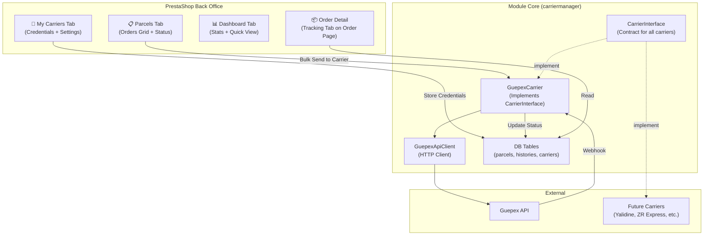

# PrestaShop Carrier Management Module — `carriermanager`

A native PrestaShop 9 module that adds a **Carrier Management** section to the back office. It allows the seller to confirm orders, batch-dispatch them to carrier APIs (starting with Guepex), track parcel status via webhooks, and manage multiple carrier credentials — all from within the PrestaShop admin.

## User Review Required

> [!IMPORTANT]
> **Module Name**: I'm proposing `carriermanager` as the internal module name. This follows PS naming conventions (lowercase, no underscores). The display name in the BO menu would be **"Carrier Manager"**. Let me know if you prefer a different name.

> [!IMPORTANT]
> **Menu Placement**: I plan to place the module under **Sell → Carrier Manager** in the BO sidebar (same level as Orders, Catalog, Customers). This matches your requirement of a page "similar to the orders page." Alternatively, it could go under **Shipping** or as a sub-item of Orders. Which do you prefer?

> [!WARNING]
> **Database Tables**: The module will create its own tables in the PrestaShop database (prefixed with `ps_`). These are separate from the `carrier_parcels` / `carrier_parcel_histories` tables in your Laravel API database. Since we're going with Approach A (self-contained module), data lives in PS's database only. The Laravel API carrier tables will no longer be needed for this workflow.

## Open Questions

> [!IMPORTANT]
> **Webhook URL**: Guepex needs a public URL to send status updates to. For your local dev environment (Laragon), you'll need a tool like **ngrok** or **expose** to receive webhooks. Is that something you have set up, or should we handle webhook sync via a cron poll as a fallback?

> [!IMPORTANT]  
> **Order Confirmation Flow**: When you manually confirm an order, should the module also update the PrestaShop order state (e.g., to a custom "Confirmed" state)? Or should the module's "confirmed" status be completely separate from PS's native order states?

---

## Architecture Overview



---

## Proposed Changes

### Database Layer

#### [NEW] `Resources/data/install.sql`

Three tables created on module install (all prefixed with `ps_`):

| Table | Purpose |
|-------|---------|
| `cm_carrier_accounts` | Stores carrier API credentials per carrier type (Guepex, future carriers). Columns: `id`, `carrier_code` (e.g., "guepex"), `display_name`, `api_id`, `api_token`, `extra_config` (JSON for carrier-specific fields), `is_default`, `is_active`, `created_at`, `updated_at` |
| `cm_parcels` | Links PS orders to carrier parcels. Columns mirror your existing Laravel `carrier_parcels` table: `id`, `order_id`, `carrier_account_id`, `tracking`, `import_id`, `label_url`, `delivery_type`, `is_economic`, `wilaya_id`, `wilaya_name`, `commune_id`, `commune_name`, `center_id`, `center_name`, `delivery_fee`, `freeshipping`, `price`, `weight`, `status` (starts as "not_confirmed"), `status_changed_at`, `shipped_at`, `delivered_at`, `created_at`, `updated_at` |
| `cm_parcel_histories` | Status change audit log. Columns: `id`, `parcel_id`, `status`, `reason`, `raw_payload` (JSON), `occurred_at`, `created_at` |

#### [NEW] `src/Database/ModuleInstaller.php`
Handles table creation/deletion using Doctrine DBAL (same pattern as the `demodoctrine` example).

---

### Carrier Abstraction Layer (Multi-Carrier Support)

#### [NEW] `src/Carrier/CarrierInterface.php`
Contract that every carrier driver must implement:

```php
interface CarrierInterface
{
    public function getCode(): string;              // e.g., 'guepex'
    public function getName(): string;              // e.g., 'Guepex'
    public function createParcels(array $orders, array $credentials): array;
    public function getParcelStatus(string $tracking, array $credentials): array;
    public function getStatuses(): array;           // All possible statuses
    public function mapStatusToPhase(string $status): string;  // processing|shipping|delivered|failed|returned
    public function mapStatusToPsOrderState(string $status): ?int;
    public function getAuthFields(): array;         // ['api_id' => 'API ID', 'api_token' => 'API Token']
}
```

#### [NEW] `src/Carrier/CarrierRegistry.php`
Service that holds all registered carrier drivers. Controllers ask the registry for the right driver by `carrier_code`.

#### [NEW] `src/Carrier/Guepex/GuepexCarrier.php`
Implements `CarrierInterface`. Ported from your Laravel [GuepexService.php](file:///c:/laragon/www/laravel-api/app/Services/Guepex/GuepexService.php) — same logic for parcel creation, fee calculation, status mapping.

#### [NEW] `src/Carrier/Guepex/GuepexApiClient.php`
Low-level HTTP client ported from your Laravel [GuepexClient.php](file:///c:/laragon/www/laravel-api/app/Services/Guepex/GuepexClient.php). Uses Symfony's `HttpClient` instead of Laravel's `Http` facade. Same rate-limit awareness, same endpoint methods.

#### [NEW] `src/Carrier/Guepex/GuepexParcelStatus.php`
Status enum ported from your Laravel [GuepexParcelStatus.php](file:///c:/laragon/www/laravel-api/app/Enums/GuepexParcelStatus.php). Same French status strings, same phase mapping, same PS order state mapping.

---

### Admin Controllers

All controllers extend `PrestaShopAdminController` (PS9 modern pattern).

#### [NEW] `src/Controller/Admin/ParcelController.php`
**The main "Parcels" page** — equivalent to the Orders page but for carrier management.

| Action | Route | Description |
|--------|-------|-------------|
| `indexAction` | `GET /carrier-manager/parcels` | Grid view of all orders with their parcel/carrier status. Includes filters by status, wilaya, date, tracking. |
| `searchAction` | `POST /carrier-manager/parcels` | Grid search/filter handler |
| `confirmAction` | `POST /carrier-manager/parcels/{orderId}/confirm` | Mark a single order as "confirmed" |
| `confirmBulkAction` | `POST /carrier-manager/parcels/bulk-confirm` | Bulk confirm selected orders |
| `sendToCarrierAction` | `POST /carrier-manager/parcels/{orderId}/send` | Send a single confirmed order to the carrier API |
| `sendBulkToCarrierAction` | `POST /carrier-manager/parcels/bulk-send` | **Batch send** selected confirmed orders to carrier API |
| `viewAction` | `GET /carrier-manager/parcels/{parcelId}` | Detailed view of a single parcel with full timeline |
| `downloadLabelAction` | `GET /carrier-manager/parcels/{parcelId}/label` | Download/redirect to the shipping label PDF |

**Grid columns:**
- Checkbox (for bulk actions)
- Order ID (linked to PS order page)
- Customer name
- Wilaya / Commune
- Total amount
- Status badge (color-coded: 🟡 Not Confirmed, 🟢 Confirmed, 🔵 Shipped, ✅ Delivered, 🔴 Failed, ⚫ Returned)
- Tracking number
- Carrier name
- Date
- Actions (Confirm / Send to Carrier / View / Label)

**Bulk actions:**
- Confirm selected orders
- Send selected to carrier
- Download labels for selected

#### [NEW] `src/Controller/Admin/CarrierAccountController.php`
**The "My Carriers" tab** — manage carrier API credentials.

| Action | Route | Description |
|--------|-------|-------------|
| `indexAction` | `GET /carrier-manager/carriers` | Grid of configured carrier accounts |
| `editAction` | `GET/POST /carrier-manager/carriers/{id}/edit` | Edit carrier credentials (API ID, API Token) |
| `toggleDefaultAction` | `POST /carrier-manager/carriers/{id}/toggle-default` | Set a carrier as default |
| `testConnectionAction` | `POST /carrier-manager/carriers/{id}/test` | Test API credentials (AJAX) |

On module install, a default Guepex account row is seeded (with empty credentials). The seller fills in their API ID and Token. The form fields are dynamically generated from `CarrierInterface::getAuthFields()` — future carriers may need different fields.

#### [NEW] `src/Controller/Admin/DashboardController.php`
**Dashboard/stats tab** — overview of carrier operations.

| Action | Route | Description |
|--------|-------|-------------|
| `indexAction` | `GET /carrier-manager/dashboard` | Stats overview |

Displays:
- KPI cards: Total parcels, In transit, Delivered today, Failed, Pending confirmation
- Status breakdown chart (pie/donut)
- Recent activity feed (last 10 status changes)

#### [NEW] `src/Controller/Admin/WebhookController.php`
**Public webhook endpoint** — receives status updates from Guepex.

| Action | Route | Description |
|--------|-------|-------------|
| `handleAction` | `POST /carrier-manager/webhook/{carrierCode}` | Receives webhook payload, validates signature, updates parcel status |

This is a **front controller** (not admin) — it's publicly accessible but validates the incoming request via the carrier's authentication mechanism.

---

### Grid System (PS9 Grid Component)

#### [NEW] `src/Grid/Definition/Factory/ParcelGridDefinitionFactory.php`
Defines columns, filters, row actions, and bulk actions for the Parcels grid. Follows the same pattern as `QuoteGridDefinitionFactory` from the official `demodoctrine` example.

#### [NEW] `src/Grid/Query/ParcelQueryBuilder.php`
DBAL query builder that joins `cm_parcels` with `ps_orders`, `ps_customer`, and `ps_address` to build the grid data. Supports filtering by status, date range, wilaya, tracking, and customer name.

#### [NEW] `src/Grid/Filters/ParcelFilters.php`
Filter defaults (limit, offset, sort order).

#### [NEW] `src/Grid/Definition/Factory/CarrierAccountGridDefinitionFactory.php`
Grid definition for the My Carriers tab.

#### [NEW] `src/Grid/Query/CarrierAccountQueryBuilder.php`
Query builder for carrier accounts.

#### [NEW] `src/Grid/Filters/CarrierAccountFilters.php`
Filter defaults for carrier accounts grid.

---

### Twig Templates

#### [NEW] `views/templates/admin/parcels/index.html.twig`
Main parcels grid page. Extends `@PrestaShop/Admin/layout.html.twig`. Includes the grid panel + KPI summary cards at the top.

#### [NEW] `views/templates/admin/parcels/view.html.twig`
Detailed parcel view with:
- Order info card
- Parcel info card (tracking, delivery type, carrier, etc.)
- Status timeline (vertical timeline showing all status changes from `cm_parcel_histories`)
- Action buttons (download label, view on PS order page)

#### [NEW] `views/templates/admin/carriers/index.html.twig`
Carrier accounts grid page.

#### [NEW] `views/templates/admin/carriers/edit.html.twig`
Edit carrier credentials form.

#### [NEW] `views/templates/admin/dashboard/index.html.twig`
Dashboard with stats cards and charts.

---

### Module Configuration

#### [NEW] `config/routes.yml`
All route definitions mapping URLs to controller actions (following the `demodoctrine` pattern with `_legacy_controller` and `_legacy_link`).

#### [NEW] `config/services.yml`
Service definitions:
- Controllers (autowired)
- Grid factories, query builders, data providers
- CarrierRegistry + individual carrier drivers
- Database installer

#### [NEW] `composer.json`
PSR-4 autoloading: `"Module\\CarrierManager\\": "src/"`

#### [NEW] `carriermanager.php`
Main module class:
- Registers tabs (menu entries under "Sell")
- Installs/uninstalls tables
- Seeds default carrier accounts
- Registers hooks (`displayAdminOrderTabLink`, `displayAdminOrderTabContent` for the order detail tracking tab)

#### [NEW] `config.xml`
Module metadata (name, version, description).

---

### Hooks (Order Detail Integration)

The module hooks into the PS order detail page to add a **"Carrier Tracking"** tab:

#### Hook: `displayAdminOrderTabLink`
Adds a tab link in the order detail page sidebar.

#### Hook: `displayAdminOrderTabContent`  
Renders the tracking timeline and parcel details inside the order detail page.

This way, when viewing any order in PS's native Orders page, you'll see the carrier tracking info right there.

---

### JavaScript

#### [NEW] `views/js/parcels.js`
Handles:
- Grid initialization (sorting, pagination, bulk checkboxes)
- AJAX calls for confirm/send-to-carrier actions with loading states
- Toast notifications for success/error feedback

#### [NEW] `views/js/carriers.js`
Handles:
- "Test Connection" button AJAX call
- Dynamic form fields based on carrier type

#### [NEW] `views/css/carriermanager.css`
Custom styles for:
- Status badges (color-coded)
- Timeline component on parcel detail view
- KPI cards on dashboard
- Uses PS9's Bootstrap 5 UI kit variables for consistency

---

## Module File Structure

```
modules/carriermanager/
├── carriermanager.php                          # Main module class
├── composer.json                                # PSR-4 autoload
├── config.xml                                   # Module metadata
├── logo.png                                     # Module icon
├── config/
│   ├── routes.yml                               # All routes
│   └── services.yml                             # DI service definitions
├── Resources/
│   └── data/
│       └── install.sql                          # Table creation SQL
├── src/
│   ├── Carrier/
│   │   ├── CarrierInterface.php                 # Contract
│   │   ├── CarrierRegistry.php                  # Driver registry
│   │   └── Guepex/
│   │       ├── GuepexCarrier.php                # Business logic
│   │       ├── GuepexApiClient.php              # HTTP client
│   │       └── GuepexParcelStatus.php           # Status enum
│   ├── Controller/
│   │   └── Admin/
│   │       ├── ParcelController.php             # Main parcels page
│   │       ├── CarrierAccountController.php     # My Carriers tab
│   │       ├── DashboardController.php          # Dashboard tab
│   │       └── WebhookController.php            # Webhook receiver
│   ├── Database/
│   │   └── ModuleInstaller.php                  # Table install/uninstall
│   └── Grid/
│       ├── Definition/Factory/
│       │   ├── ParcelGridDefinitionFactory.php
│       │   └── CarrierAccountGridDefinitionFactory.php
│       ├── Filters/
│       │   ├── ParcelFilters.php
│       │   └── CarrierAccountFilters.php
│       └── Query/
│           ├── ParcelQueryBuilder.php
│           └── CarrierAccountQueryBuilder.php
├── views/
│   ├── css/
│   │   └── carriermanager.css
│   ├── js/
│   │   ├── parcels.js
│   │   └── carriers.js
│   └── templates/
│       └── admin/
│           ├── parcels/
│           │   ├── index.html.twig
│           │   └── view.html.twig
│           ├── carriers/
│           │   ├── index.html.twig
│           │   └── edit.html.twig
│           ├── dashboard/
│           │   └── index.html.twig
│           └── hooks/
│               ├── order_tab_link.html.twig
│               └── order_tab_content.html.twig
```

---

## Implementation Phases

Given the size of this module, I recommend building it in **3 phases**:

### Phase 1 — Foundation & Parcels Grid (Core MVP)
1. Module skeleton (main class, composer, config, tables)
2. Carrier abstraction layer (interface + Guepex implementation)
3. Port GuepexApiClient + GuepexCarrier from Laravel
4. Parcels grid page with all columns/filters
5. Confirm & Send-to-Carrier actions (single + bulk)
6. Webhook endpoint for status updates
7. Basic status badge rendering

### Phase 2 — My Carriers & Order Integration
8. Carrier Accounts grid + edit form
9. Test Connection feature
10. Order detail tab hooks (tracking timeline on order page)
11. Label download action

### Phase 3 — Dashboard & Polish
12. Dashboard with KPI cards and stats
13. CSS polish (status colors, timeline component)
14. Error handling refinement
15. Module install/uninstall testing

---

## Verification Plan

### Manual Verification
1. Install the module via PrestaShop BO → Modules → Install
2. Verify the "Carrier Manager" menu appears under Sell
3. Navigate to Parcels tab — verify orders grid loads with PS orders data
4. Configure Guepex credentials in My Carriers tab
5. Select orders → Confirm → Send to Carrier → verify Guepex API is called
6. Trigger a webhook → verify parcel status updates
7. View an order in PS Orders page → verify the Carrier Tracking tab appears
8. Uninstall module → verify tables are dropped cleanly

### Automated Tests
- We can test the API client with mocked HTTP responses if needed
- Grid queries can be verified against the PS test database
